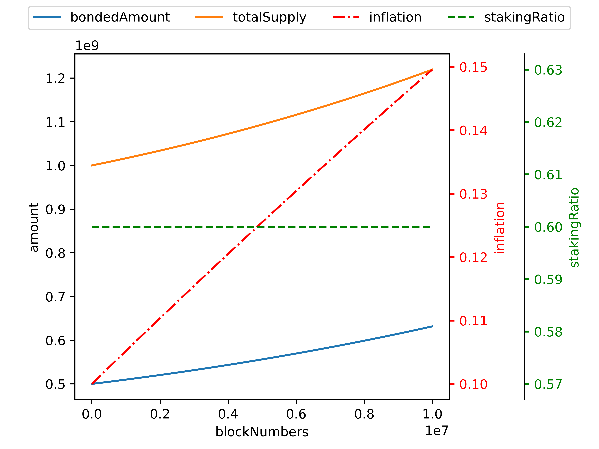
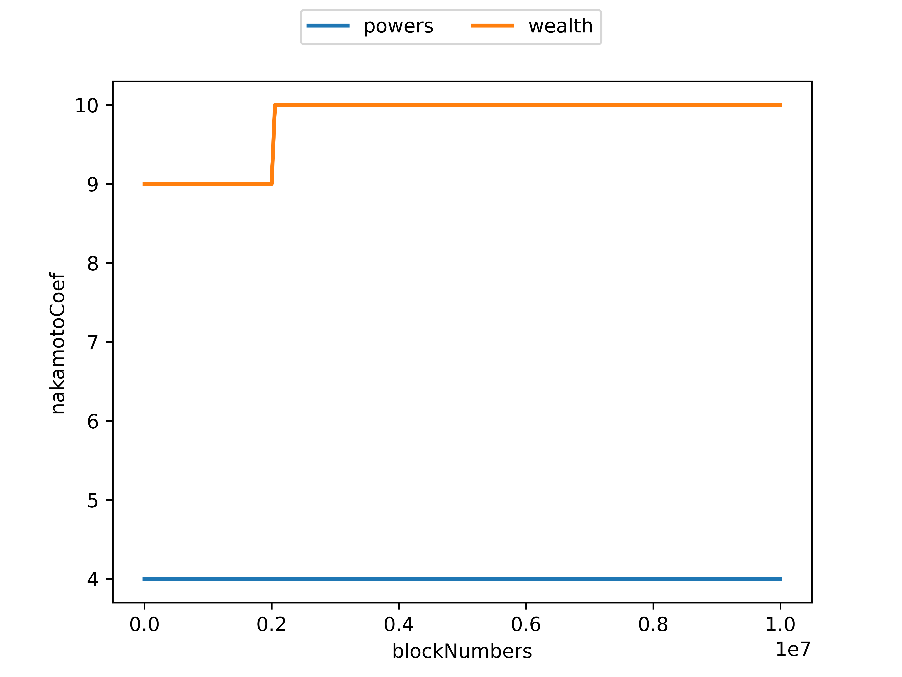

# Delegated Proof-of-Quadratic-Staking (DPoQS)

In DPoS, the number of delegators does not affect the reward distribution and voting power.
However, the number is as valuable as the amount in decentralization.
For example, it may be worth 100 delegations from 10 people (each person delegates 10) rather than 100 delegations from 1 person.

DPoQS reduces the expected return when a delegator delegates all his tokens to a single validator.
It makes participants delegate to various validators, and the system can achieve more decentralization.

In DPoQS, the power of monopolists (a.k.a. the whales) and VCs with a lot of money are effectively suppressed but not ignored.
The validators with much support from the community may have more power than the DPoS case.

# Quadratic Staking (QS)

[Quadratic Funding (QF)](https://wtfisqf.com/?grant=&grant=&grant=&grant=&match=1000) is the optimal way to fund public goods in a democratic community.
Similarly, QS is the mathematically optimal way to stake for decentralization and security in a staking pool blockchain.

See the following example:

## Example

|   | Validator 1 | Validator 2 | Validator 3 | 
|---|---|---|---|
|Stakings|[100]|[50, 50]|[10, 20, 30, 40]|
|Power|$\sqrt{100}=10$|$\sqrt{50}+\sqrt{50}=14.1421$|$\sqrt{10}+\sqrt{20}+\sqrt{30}+\sqrt{40}=19.4362$|

Let's say that there's a newly minted $100$ token here:

**Validator 1** will receive $100 * 10 / (10 + 14.1421 + 19.4362) = 22.95$ tokens
* Delegator 1-1 ($100$) will receive $22.95 * 100 / (100) = 22.95$ tokens

**Validator 2** will receive $100 * 14.1421 / (10 + 14.1421 + 19.4362) = 32.45$ tokens
* Delegator 2-1 ($50$) will receive $32.45 * 50 / (50 + 50) = 16.225$ tokens
* Delegator 2-2 ($50$) will receive $32.45 * 50 / (50 + 50) = 16.225$ tokens

**Validator 3** will receive $100 * 19.4362 / (10 + 14.1421 + 19.4362) = 44.60$ tokens
* Delegator 3-1 ($10$) will receive $44.60 * 10 / (10 + 20 + 30 + 40) = 4.46$ tokens
* Delegator 3-2 ($20$) will receive $44.60 * 20 / (10 + 20 + 30 + 40) = 8.92$ tokens
* Delegator 3-3 ($30$) will receive $44.60 * 30 / (10 + 20 + 30 + 40) = 13.38$ tokens
* Delegator 3-4 ($40$) will receive $44.60 * 40 / (10 + 20 + 30 + 40) = 17.84$ tokens

<!--
Level 1: Distributes Quadratic
    * Level 2: Distributes Linearly
-->

<!-- effect: more decentralizing -->


<!--
# Features

- Like monopoly cost, delegation to a single validator with a pretty penny is economically sublated.
- Quadratic Funding: More support, more rewards.

# Discussion

- Identity: DPoQS is the compromise between 1$1V and 1P1V. It needs the identity.

# Notes

- In this simulation, self-delegating is unavailable.
-->

# Simulation

## How to Use Simulator

```bash
$ python simulator/<simulating_env>/run.py
```

For example, run `$ python simulator/all/run.py` to simulate **All Envs**.

`simulating_env`s:

* All environments: `all`
* PoS: `pos`
* DPoS: `dpos`
* DPoQS: `dpoqs`

## Commands

Press `[H]` for help.

```
Simulator Commands
    [N]nextBlocks             <#_of_blocks>
    [B]bondedAmount           <bonded_amount>
    [S]stakingRatio           <%_of_staking_ratio>
    [V]validate_cost          <amount>
    [C]delegate_cost          <amount>

Logs Commands
    [P]step(window)           <size_of_step>
    [K]saveFigs               <name> [dpi]
    [L]saveLogs               <name>
```

> **NOTE**: Please input `:` before typing the command.

For example,

```
: N 10000000
```

Pass by 10,000,000 blocks.

```
: L test
```

Save `test_agents.csv`, `test_coef.csv`, `test_provs.csv` and `test_state.csv` files in `logs/`.

```
: K test 600
```

Save `test_agents.png`, `test_coef.png`, `test_provs.png` and `test_state.png` files in `plots/`.




# References

- [Quadratic Voting: How Mechanism Design Can Radicalize Democracy](https://www.aeaweb.org/articles?id=10.1257/pandp.20181002)
- [A Flexible Design for Funding Public Goods](https://arxiv.org/pdf/1809.06421.pdf)
- [Governor-C](https://github.com/D3LAB-DAO/Governor-C)
- [Do the Rich Get Richer? Fairness Analysis for Blockchain Incentives](https://dl.acm.org/doi/abs/10.1145/3448016.3457285)

## Acknowledgment

Appreciate the technical and financial support from [Chainlink](https://chain.link).

<!--
# TODO
- set bondedAmount
- Cost norm dist.
- Smart agents (AI)
- Transition Progress Bar
-->

<!--
# TODO?
- N step: for loop -> one transition
- Console mode
- Genesis JSON
- Exception handling
- Supernova
    - Distributions
- x-axis w/ time (d/m/y)
-->
